# Analiza e cënueshmërisë dhe raportimi teknik për një platformë web në mjedis laboratorik

## Hyrje

Ky dokument paraqet analizën e cënueshmërisë së një platforme web të vendosur në një mjedis laboratorik të kontrolluar, me qëllim identifikimin, interpretimin dhe raportimin teknik të dobësive të sigurisë. Për realizimin e aktivitetit është përdorur `OWASP Juice Shop`, një aplikacion i ndërtuar qëllimisht për security testing dhe training, i përshtatshëm për analiza të tipit `vulnerability assessment` dhe `DAST`.

Në kuadër të detyrës janë aplikuar 5 automated tools dhe 5 platforma online për evidentimin e pikave të dobëta në lidhje me sigurinë. Gjithashtu, është realizuar edhe një analizues i thjeshtë në Python, i cili shërben si shtesë analitike për kontrollimin e security headers, exposed paths dhe konfigurimeve bazë të sigurisë së platformës.

Objektivi kryesor i këtij punimi është krahasimi i rezultateve midis një implementimi me `HTTP` dhe një implementimi me `HTTPS`. Për ta bërë analizën më të plotë, është përfshirë edhe një fazë remediation dhe retest për të verifikuar përmirësimin e konfigurimit pas aplikimit të masave të hardening.

## Përshkrimi i mjedisit laboratorik

Mjedisi laboratorik është ndërtuar në Docker, duke përdorur `OWASP Juice Shop` si target kryesor të analizës. Aplikacioni është vendosur në dy forma: një instancë e aksesueshme përmes `HTTP` dhe një instancë e dytë e aksesueshme përmes `HTTPS` përmes një Nginx reverse proxy me self-signed certificate.

Kjo qasje mundëson krahasim teknik të drejtë, pasi i njëjti aplikacion analizohet në dy konfigurime të ndryshme, pa ndryshuar logjika aplikative. Për validime shtesë të `SSL`/`TLS` behavior është përdorur edhe `badssl`, i cili ofron endpoint-e publike të ndërtuara posaçërisht për të demonstruar raste të ndryshme të certifikatave dhe konfigurimeve `HTTPS`.

### Komponentët kryesorë të lab-it

- **Target 1**: OWASP Juice Shop me `HTTP`.
- **Target 2**: OWASP Juice Shop me `HTTPS` prapa Nginx reverse proxy.
- **Automated tools**: OWASP ZAP, Nmap, Nikto, Nuclei.
- **Online platforms**: Qualys SSL Labs, SecurityHeaders, MDN HTTP Observatory, VirusTotal URL scan, badssl.

### Komandat për ndërtimin e lab-it

Shkarkimi i imazhit dhe startimi i OWASP` Juice Shop`

```bash
docker pull bkimminich/juice-shop
docker network create juice-net
docker run -d --name juice-http --network juice-net -p 3000:3000 bkimminich/juice-shop
```

Gjenerimi i self-signed certificate

```bash
mkdir -p vuln-lab/nginx/certs
cd vuln-lab

openssl req -x509 -nodes -days 365 -newkey rsa:2048 \
  -keyout nginx/certs/juice.key \
  -out nginx/certs/juice.crt
```

Konfigurimi i `nginx.conf`

```nginx
events {}

http {
    server {
        listen 8443 ssl;
        server_name localhost;

        ssl_certificate     /etc/nginx/certs/juice.crt;
        ssl_certificate_key /etc/nginx/certs/juice.key;

        location / {
            proxy_pass http://juice-http:3000;
            proxy_set_header Host $host;
            proxy_set_header X-Forwarded-Proto https;
            proxy_set_header X-Forwarded-For $proxy_add_x_forwarded_for;
        }
    }
}
```

Startimi i Nginx reverse proxy

```bash
docker run -d --name juice-https \
  --network juice-net \
  -p 8443:8443 \
  -v "$(pwd)/nginx.conf:/etc/nginx/nginx.conf:ro" \
  -v "$(pwd)/nginx/certs:/etc/nginx/certs:ro" \
  nginx:latest
```

Verifikimi i container-ave dhe i shërbimeve

```bash
docker ps
docker logs juice-http
docker logs juice-https
docker exec -it juice-https nginx -t
curl -k https://localhost:8443
```

## Metodologjia e analizës

Metodologjia e përdorur në këtë aktivitet është bazuar në kombinimin e local automated scanning dhe online validation platforms, me qëllim mbulimin e disa shtresave të sigurisë: transport layer, web server configuration, HTTP response headers, application behavior dhe lightweight custom analysis. Kjo metodë ndihmon që analiza të mos mbetet vetëm te një burim i vetëm rezultatesh, por të ketë cross-validation midis mjeteve të ndryshme.

### Mjetet e automatizuara të përdorura

#### 1. OWASP ZAP

OWASP ZAP është përdorur si mjeti kryesor për web application scanning, duke shfrytëzuar crawling, passive scan dhe active scan mbi target-in `HTTP` dhe target-in `HTTPS`. Ky mjet është i përshtatshëm për identifikimin e security misconfiguration, missing headers, insecure cookies dhe gjetjeve të tjera të zakonshme në aplikacione web.

#### 2. Burp Suite

Burp Suite është përdorur për validim shtesë të gjetjeve, kontroll më të rafinuar të scope-it dhe krahasim të sjelljes së aplikacionit midis `HTTP` dhe `HTTPS`. Burp Suite DAST mbështet crawling dhe scan configuration të avancuar, duke e bërë të dobishëm për verifikim të rezultateve të marra nga ZAP.

#### 3. Nmap

Nmap është përdorur për service enumeration dhe për identifikimin e porteve të ekspozuara në hostin lokal. Në këtë rast, ai ka shërbyer për të verifikuar ekspozimin e portit `3000` për `HTTP` dhe portit `8443` për `HTTPS`.

#### 4. Nikto

Nikto është përdorur për web server scanning, me fokus në common files, exposed paths dhe server misconfiguration. Ky mjet është veçanërisht i dobishëm për të gjetur probleme si missing security headers ose elementë të panevojshëm të ekspozuar në server.

#### 5. Nuclei

Nuclei është përdorur si template-based vulnerability scanner për të kryer kontrolle të strukturuara dhe të përsëritshme mbi target-et e zgjedhur. Avantazhi i tij kryesor është përdorimi i templates YAML dhe klasifikimi i gjetjeve sipas severity level.

### Platformat online të përdorura

#### 1. Qualys SSL Labs

Qualys SSL Labs është përdorur për vlerësimin e SSL/TLS configuration, certificate behavior, supported protocols dhe cipher suites në target-in HTTPS.

#### 2. SecurityHeaders

SecurityHeaders është përdorur për analizën e HTTP response headers dhe për identifikimin e mungesës së headers si CSP, HSTS, X-Frame-Options dhe X-Content-Type-Options.

#### 3. MDN HTTP Observatory

MDN HTTP Observatory është përdorur për hardening assessment dhe për score-in e praktikave të sigurisë në nivel header-ash.

#### 4. VirusTotal URL Scan

VirusTotal URL scan është përdorur si kontroll reputacioni për URL-të publike të testuara dhe jo si mjet i drejtpërdrejtë vulnerability scanning.

#### 5. badssl

badssl është përdorur për demonstrime dhe validime të ndryshme të SSL/TLS behavior, përfshirë raste si self-signed certificates, expired certificates dhe HSTS behavior.

## Hapat e përdorimit në ZAP

Për OWASP ZAP është ndjekur workflow i Quick Start, duke vendosur fillimisht URL-në e target-it HTTP dhe më pas URL-në e target-it HTTPS, me qëllim realizimin e spider, passive scan dhe active scan. Në target-in HTTPS është pranuar local certificate warning vetëm sepse analiza është kryer në një lab të kontrolluar.

OWASP ZAP u përdor për të kryer crawling, passive scan dhe active scan mbi të njëjtin target aplikativ në dy konfigurime të ndryshme: `HTTP` dhe `HTTPS`. Analiza tregoi se diferencat kryesore midis dy rezultateve lidhen me transport security dhe me sjelljen e disa security controls në nivel response/cookie/header, ndërsa gjetjet e lidhura me vetë logjikën e aplikacionit mbetën të pranishme në të dy rastet.

Në target-in HTTP, gjetjet e ZAP priren të reflektojnë mungesën e encrypted transport, çka rrit risk-un e interception dhe manipulimit të trafikut gjatë komunikimit. Në target-in HTTPS, këto risqe reduktohen në nivel transporti, por application-layer vulnerabilities si input handling weaknesses, missing hardening headers ose gjetje të tjera në logjikën e aplikacionit nuk eliminohen automatikisht vetëm nga përdorimi i `HTTPS`.

### HTTP report

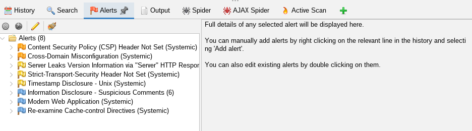

### HTTPS report

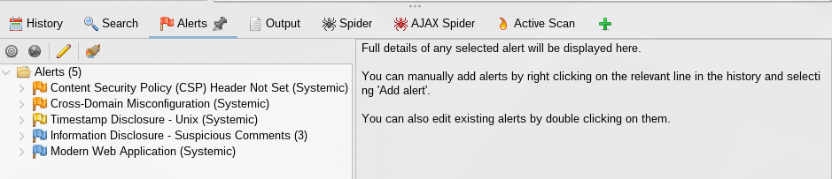

### Rezultatet, interpretimi dhe krahasimi teknik

#### Rezultatet e pritura nga analiza e target-it HTTP

Në target-in `HTTP` pritet të evidentohen dobësi të lidhura me mungesën e encrypted transport, mungesën ose dobësinë e security headers, si dhe dobësi të tjera aplikative që nuk varen nga protokolli i transportit. Përdorimi i HTTP rrit risk-un e interception dhe manipulimit të trafikut gjatë transmetimit, edhe nëse aplikacioni është i njëjtë në nivel logjike.

#### Rezultatet e pritura nga analiza e target-it HTTPS

Në target-in `HTTPS` pritet një përmirësim në confidentiality dhe integrity gjatë transportit, pasi komunikimi kalon në një kanal të enkriptuar. Megjithatë, përdorimi i HTTPS nuk eliminon application-layer vulnerabilities si Broken Access Control, XSS, Injection ose security misconfiguration, të cilat mund të mbeten të pranishme në vetë logjikën e aplikacionit.

#### Krahasimi HTTP vs HTTPS

Krahasimi teknik midis HTTP dhe HTTPS është pjesa më e rëndësishme e këtij laboratori, sepse tregon se transport security përmirëson vetëm shtresën e transmetimit të të dhënave dhe jo domosdoshmërisht sigurinë totale të aplikacionit. Për këtë arsye, gjetjet duhet të interpretohen në dy nivele: findings që lidhen me protocol/security configuration dhe findings që lidhen me logjikën e aplokacionit.

| Elementi           | HTTP                                                                | HTTPS                                                                   | Interpretimi                                                      |
| ------------------ | ------------------------------------------------------------------- | ----------------------------------------------------------------------- | ----------------------------------------------------------------- |
| Transport security | Nuk ka encryption.                                                  | Ka encrypted channel.                                                   | HTTPS përmirëson integritetin gjatë transportit.                  |
| Gjetjet e ZAP      | Mund të shfaqen alerts për insecure delivery dhe mungesë hardening. | Mund të ulen findings të lidhura me transportin, por jo ato aplikative. | HTTPS nuk i zgjidh dobësitë e logjikës së aplikacionit.           |
| Nmap               | Porta 3000 e hapur për HTTP.                                        | Porta 8443 e hapur për HTTPS.                                           | Tregon sipërfaqen bazë të ekspozuar të shërbimeve.                |
| Nikto / Nuclei     | Evidentojnë misconfiguration dhe web findings                       | Mund të evidentojnë edhe probleme të TLS ose header-hardening.          | HTTPS ndihmon, por kërkon konfigurim korrekt për të qenë efektiv. |

Nga interpretimi teknik i rezultateve rezulton se përdorimi i HTTPS ka përmirësuar sigurinë e komunikimit dhe ka reduktuar një pjesë të exposure-it në nivel header-ash, por nuk ka eliminuar gjetjet që lidhen me policy configuration dhe information disclosure. Për këtë arsye, HTTPS duhet parë si një komponent i rëndësishëm i sigurisë, por jo si zgjidhje e vetme për dobësitë e aplikacionit.

## Komandat dhe output në Nmap

### HTTP

```bash
nmap -sV -Pn 127.0.0.1 -p 3000
```

```bash
Starting Nmap 7.98 ( https://nmap.org ) at 2026-04-06 14:26 +0200
Nmap scan report for localhost (127.0.0.1)
Host is up (0.000012s latency).

PORT     STATE SERVICE VERSION
3000/tcp open  ppp?

Service detection performed. Please report any incorrect results at https://nmap.org/submit/ .
Nmap done: 1 IP address (1 host up) scanned in 11.92 seconds
```

### HTTPS

```bash
nmap -sV -Pn 127.0.0.1 -p 8443
```

Output

```bash
Starting Nmap 7.98 ( https://nmap.org ) at 2026-04-06 14:28 +0200
Nmap scan report for localhost (127.0.0.1)
Host is up (0.000013s latency).

PORT     STATE SERVICE  VERSION
8443/tcp open  ssl/http nginx 1.29.7

Service detection performed. Please report any incorrect results at https://nmap.org/submit/ .
Nmap done: 1 IP address (1 host up) scanned in 12.76 seconds
```

### Rezultatet, interpretimi

Gjatë analizës me Nmap, u krye service enumeration për dy target të ndryshme të së njëjtës platformë:

- instanca `HTTP` në portën `3000`.
- instanca `HTTPS` në portën `8443`.

Rezultatet treguan se të dy portat ishin të hapura dhe hostet ishin të arritshëm, çka konfirmon ekspozimin e dy shërbimeve të ndara në nivel rrjeti.

Në target-in `HTTP`, Nmap identifikoi portën `3000`/tcp si të hapur, por nuk arriti ta klasifikojë saktë shërbimin dhe e shënoi si `ppp?`, edhe pse fingerprinti i kthyer nga serveri përmbante qartë përgjigje HTTP/1.1 200 OK dhe headera karakteristikë të një aplikacioni web. Kjo tregon se përdorimi i një portës jo-standard mund ta bëjë service identification më pak të saktë, edhe kur protokolli i përdorur është qartësisht `HTTP`.

Në target-in `HTTPS`, Nmap identifikoi portën `8443`/tcp si të hapur dhe shërbimin si `ssl/http nginx 1.29.7`, duke treguar jo vetëm përdorimin e `TLS`, por edhe praninë e një `reverse proxy nginx` me version të identifikueshëm. Ky rezultat tregon një implementim më të qartë të `HTTPS` në nivel shërbimi, por njëkohësisht zbulon version që mund të përdoret nga një sulmues.

## Komandat dhe output në Nikto

### HTTP

```bash
nikto -h http://127.0.0.1:3000
```

```bash
- Nikto v2.6.0
---------------------------------------------------------------------------
+ Your Nikto installation is out of date.
+ Target IP:          127.0.0.1
+ Target Hostname:    127.0.0.1
+ Target Port:        3000
+ Platform:           Unknown
+ Start Time:         2026-04-06 14:48:53 (GMT2)
---------------------------------------------------------------------------
+ Server: No banner retrieved
+ [999986] /: Retrieved access-control-allow-origin header: *.
+ [999100] /: Uncommon header(s) 'x-recruiting' found, with contents: /#/jobs.
+ No CGI Directories found (use '-C all' to force check all possible dirs). CGI tests skipped.
+ [999996] /robots.txt: contains 1 entry which should be manually viewed. See: https://developer.mozilla.org/en-US/docs/Glossary/Robots.txt
+ [013587] /: Suggested security header missing: referrer-policy. See: https://developer.mozilla.org/en-US/docs/Web/HTTP/Headers/Referrer-Policy
+ [013587] /: Suggested security header missing: permissions-policy. See: https://developer.mozilla.org/en-US/docs/Web/HTTP/Headers/Permissions-Policy
+ [013587] /: Suggested security header missing: content-security-policy. See: https://developer.mozilla.org/en-US/docs/Web/HTTP/CSP
+ [013587] /: Suggested security header missing: strict-transport-security. See: https://developer.mozilla.org/en-US/docs/Web/HTTP/Headers/Strict-Transport-Security
+ [001535] /.psql_history: This might be interesting.
+ [001675] /ftp/: This might be interesting.
+ [001811] /public/: This might be interesting.
+ [002739] /.htpasswd: Contains authorization information.
+ [002743] /.bash_history: A user's home directory may be set to the web root, the shell history was retrieved. This should not be accessible via the web.
+ [002748] /.mysql_history: Database SQL?.
+ [002756] /.sh_history: A user's home directory may be set to the web root, the shell history was retrieved. This should not be accessible via the web.
+ [007129] /.sqlite_history: This might be interesting.
+ [007203] /userdata.json: This might be interesting.
+ [007204] /login.json: This might be interesting.
+ [007205] /master.json: This might be interesting.
+ [007206] /masters.json: This might be interesting.
+ [007207] /connections.json: This might be interesting.
+ [007208] /connection.json: This might be interesting.
+ [007210] /PasswordsData.json: This might be interesting.
+ [007211] /users.json: This might be interesting.
+ [007212] /conndb.json: This might be interesting.
+ [007213] /conn.json: This might be interesting.
+ [007215] /accounts.json: This might be interesting.
+ [007303] /JAMonAdmin.jsp: JAMon - Java Application Monitor Admin interface identified. Versions 2.7 and earlier contain XSS vulnerabilities. See: https://cve.mitre.org/cgi-bin/cvename.cgi?name=CVE-2013-6235
+ [007352] /: The X-Content-Type-Options header is not set. This could allow the user agent to render the content of the site in a different fashion to the MIME type. See: https://www.netsparker.com/web-vulnerability-scanner/vulnerabilities/missing-content-type-header/
+ 8877 requests: 2 errors and 28 items reported on the remote host
+ End Time:           2026-04-06 14:52:56 (GMT2) (243 seconds)
---------------------------------------------------------------------------
+ 1 host(s) tested
```

Output

### HTTPS

```bash
nikto -h https://localhost:8443
```

Output

```bash
- Nikto v2.6.0
---------------------------------------------------------------------------
+ Your Nikto installation is out of date.
+ Target IP:          127.0.0.1
+ Target Hostname:    localhost
+ Target Port:        8443
---------------------------------------------------------------------------
+ SSL Info:           Subject:  /C=AL/ST=Tirana/L=Tirana/O=localhost/OU=test/CN=localhost/emailAddress=test.website@gmail.com
                      CN:       localhost
                      Ciphers:  TLS_AES_256_GCM_SHA384
                      Issuer:   /C=AL/ST=Tirana/L=Tirana/O=localhost/OU=test/CN=localhost/emailAddress=test.website@gmail.com
+ Platform:           Unknown
+ Start Time:         2026-04-06 14:54:19 (GMT2)
---------------------------------------------------------------------------
+ Server: nginx/1.29.7
+ [999986] /: Retrieved access-control-allow-origin header: *.
+ [999100] /: Uncommon header(s) 'x-recruiting' found, with contents: /#/jobs.
+ No CGI Directories found (use '-C all' to force check all possible dirs). CGI tests skipped.
+ [999996] /robots.txt: contains 1 entry which should be manually viewed. See: https://developer.mozilla.org/en-US/docs/Glossary/Robots.txt
+ [999966] /: The Content-Encoding header is set to "deflate" which may mean that the server is vulnerable to the BREACH attack. See: http://breachattack.com/
+ [013587] /: Suggested security header missing: referrer-policy. See: https://developer.mozilla.org/en-US/docs/Web/HTTP/Headers/Referrer-Policy
+ [013587] /: Suggested security header missing: content-security-policy. See: https://developer.mozilla.org/en-US/docs/Web/HTTP/CSP
+ [013587] /: Suggested security header missing: strict-transport-security. See: https://developer.mozilla.org/en-US/docs/Web/HTTP/Headers/Strict-Transport-Security
+ [013587] /: Suggested security header missing: permissions-policy. See: https://developer.mozilla.org/en-US/docs/Web/HTTP/Headers/Permissions-Policy
+ [001535] /.psql_history: This might be interesting.
+ [001675] /ftp/: This might be interesting.
+ [001811] /public/: This might be interesting.
+ [002739] /.htpasswd: Contains authorization information.
+ [002743] /.bash_history: A user's home directory may be set to the web root, the shell history was retrieved. This should not be accessible via the web.
+ [002748] /.mysql_history: Database SQL?.
+ [002756] /.sh_history: A user's home directory may be set to the web root, the shell history was retrieved. This should not be accessible via the web.
+ [007129] /.sqlite_history: This might be interesting.
+ [007203] /userdata.json: This might be interesting.
+ [007204] /login.json: This might be interesting.
+ [007205] /master.json: This might be interesting.
+ [007206] /masters.json: This might be interesting.
+ [007207] /connections.json: This might be interesting.
+ [007208] /connection.json: This might be interesting.
+ [007210] /PasswordsData.json: This might be interesting.
+ [007211] /users.json: This might be interesting.
+ [007212] /conndb.json: This might be interesting.
+ [007213] /conn.json: This might be interesting.
+ [007215] /accounts.json: This might be interesting.
+ [007303] /JAMonAdmin.jsp: JAMon - Java Application Monitor Admin interface identified. Versions 2.7 and earlier contain XSS vulnerabilities. See: https://cve.mitre.org/cgi-bin/cvename.cgi?name=CVE-2013-6235
+ [007352] /: The X-Content-Type-Options header is not set. This could allow the user agent to render the content of the site in a different fashion to the MIME type. See: https://www.netsparker.com/web-vulnerability-scanner/vulnerabilities/missing-content-type-header/
+ 8648 requests: 18 errors and 29 items reported on the remote host
+ End Time:           2026-04-06 15:04:46 (GMT2) (627 seconds)
---------------------------------------------------------------------------
+ 1 host(s) tested
```

### Rezultatet, interpretimi

Gjatë analizës me Nikto, u vu re se shumica e findings ishin të përbashkëta midis target-it `HTTP` dhe target-it `HTTPS`, çka tregon se pjesa më e madhe e ekspozimit lidhet me content discovery, interesting paths dhe mungesën e disa security headers, jo vetëm me protokollin e transportit. Të dy target-et raportuan Access-Control-Allow-Origin: \*, robots.txt, header-in e pazakontë x-recruiting, si dhe mungesën e Referrer-Policy, Permissions-Policy, Content-Security-Policy dhe Strict-Transport-Security.

Nikto zbuloi gjithashtu në të dy rastet një numër të madh paths dhe files potencialisht të ndjeshme ose interesante, si .htpasswd, .bash_history, .mysql_history, users.json, login.json dhe accounts.json. Kjo sugjeron se sipërfaqja e ekspozimit aplikativ mbetet e ngjashme edhe pas kalimit në `HTTPS`, pra `HTTPS` nuk eliminon vetvetiu content exposure ose misconfiguration në nivel aplikacioni.

Dallimi kryesor midis dy skanimeve ishte se në target-in `HTTPS`, Nikto identifikoi qartë Server: nginx/1.29.7, si dhe dha SSL Info të detajuar për certifikatën dhe cipher-in e përdorur. Në target-in `HTTP`, përkundrazi, server banner nuk u mor fare, gjë që e bën `HTTPS` më të fortë në transport security, por njëkohësisht më të ekspozuar në aspektin e service fingerprinting.

Një finding shtesë që u raportua vetëm në target-in `HTTPS` ishte përdorimi i Content-Encoding: deflate, i cili sipas Nikto mund të lidhet me risk të tipit `BREACH`. Ky ndryshim është teknikisht i rëndësishëm, sepse tregon se aktivizimi i `HTTPS` mund të shtojë edhe kategori të reja findings që lidhen specifikisht me encrypted transport.

## Komandat dhe output në Nmap

### HTTP

```bash
nuclei -u http://127.0.0.1:3000
```

output

```bash
                     __     _
   ____  __  _______/ /__  (_)
  / __ \/ / / / ___/ / _ \/ /
 / / / / /_/ / /__/ /  __/ /
/_/ /_/\__,_/\___/_/\___/_/   v3.7.1

		projectdiscovery.io

[WRN] Found 1 templates with runtime error (use -validate flag for further examination)
[INF] Current nuclei version: v3.7.1 (latest)
[INF] Current nuclei-templates version: v10.4.1 (latest)
[INF] New templates added in latest release: 76
[INF] Templates loaded for current scan: 9976
[INF] Executing 9959 signed templates from projectdiscovery/nuclei-templates
[WRN] Loading 17 unsigned templates for scan. Use with caution.
[INF] Targets loaded for current scan: 1
[INF] Templates clustered: 2260 (Reduced 2134 Requests)
[INF] Using Interactsh Server: oast.pro
[swagger-api] [http] [info] http://127.0.0.1:3000/api-docs/swagger.json [paths="/api-docs/swagger.json"]
[INF] Skipped 127.0.0.1:9780 from target list as found unresponsive permanently: cause="port closed or filtered" address=127.0.0.1:9780 chain="connection refused; got err while executing http://127.0.0.1:9780/api/v1/user_assets/nfc"
[dameng-detect] [javascript] [info] 127.0.0.1:3000
[snmpv3-detect] [javascript] [info] 127.0.0.1:3000 ["Enterprise: unknown"]
[addeventlistener-detect] [http] [info] http://127.0.0.1:3000
[deprecated-feature-policy] [http] [info] http://127.0.0.1:3000 ["payment 'self'"]
[owasp-juice-shop-detect] [http] [info] http://127.0.0.1:3000
[robots-txt-endpoint:endpoints] [http] [info] http://127.0.0.1:3000/robots.txt ["/ftp"]
[x-recruiting-header] [http] [info] http://127.0.0.1:3000 ["/#/jobs"]
[INF] Skipped 127.0.0.1:4040 from target list as found unresponsive permanently: cause="port closed or filtered" address=127.0.0.1:4040 chain="connection refused; got err while executing https://127.0.0.1:4040/jobs/?\"'><script>alert(document.domain)</script>"
[security-txt] [http] [info] http://127.0.0.1:3000/.well-known/security.txt ["mailto:donotreply@owasp-juice.shop"]
[robots-txt] [http] [info] http://127.0.0.1:3000/robots.txt
[prometheus-metrics] [http] [medium] http://127.0.0.1:3000/metrics
[fingerprinthub-web-fingerprints:qm-system] [http] [info] http://127.0.0.1:3000
[INF] Skipped [127.0.0.1:3000]:5814 from target list as found unresponsive permanently: Get "https://127.0.0.1:3000:5814/autopass": cause="no address found for host"
[INF] Skipped 127.0.0.1:3000 from target list as found unresponsive permanently: cause="no address found for host" chain="got err while executing https://127.0.0.1:3000:5814/autopass"
[http-missing-security-headers:strict-transport-security] [http] [info] http://127.0.0.1:3000
[http-missing-security-headers:permissions-policy] [http] [info] http://127.0.0.1:3000
[http-missing-security-headers:x-permitted-cross-domain-policies] [http] [info] http://127.0.0.1:3000
[http-missing-security-headers:cross-origin-opener-policy] [http] [info] http://127.0.0.1:3000
[http-missing-security-headers:cross-origin-resource-policy] [http] [info] http://127.0.0.1:3000
[http-missing-security-headers:content-security-policy] [http] [info] http://127.0.0.1:3000
[http-missing-security-headers:referrer-policy] [http] [info] http://127.0.0.1:3000
[http-missing-security-headers:clear-site-data] [http] [info] http://127.0.0.1:3000
[http-missing-security-headers:cross-origin-embedder-policy] [http] [info] http://127.0.0.1:3000
[http-missing-security-headers:missing-content-type] [http] [info] http://127.0.0.1:3000
[INF] Skipped 127.0.0.1:3000 from target list as found unresponsive 30 times
[INF] Scan completed in 3m. 22 matches found.
```

### HTTPS

```bash
nuclei -u https://localhost:8443
```

Output

```bash
                     __     _
   ____  __  _______/ /__  (_)
  / __ \/ / / / ___/ / _ \/ /
 / / / / /_/ / /__/ /  __/ /
/_/ /_/\__,_/\___/_/\___/_/   v3.7.1

		projectdiscovery.io

[WRN] Found 1 templates with runtime error (use -validate flag for further examination)
[INF] Current nuclei version: v3.7.1 (latest)
[INF] Current nuclei-templates version: v10.4.1 (latest)
[INF] New templates added in latest release: 76
[INF] Templates loaded for current scan: 9976
[INF] Executing 9959 signed templates from projectdiscovery/nuclei-templates
[WRN] Loading 17 unsigned templates for scan. Use with caution.
[INF] Targets loaded for current scan: 1
[INF] Templates clustered: 2260 (Reduced 2134 Requests)
[INF] Using Interactsh Server: oast.online
[swagger-api] [http] [info] https://localhost:8443/api-docs/swagger.yaml [paths="/api-docs/swagger.yaml"]
[waf-detect:nginxgeneric] [http] [info] https://localhost:8443
[INF] Skipped localhost:9780 from target list as found unresponsive permanently: cause="port closed or filtered" address=localhost:9780 chain="connection refused; got err while executing https://localhost:9780/api/v1/user_assets/nfc"
[snmpv3-detect] [javascript] [info] localhost:161 ["Enterprise: unknown"]
[tls-version] [ssl] [info] localhost:8443 ["tls12"]
[tls-version] [ssl] [info] localhost:8443 ["tls13"]
[http-missing-security-headers:permissions-policy] [http] [info] https://localhost:8443
[http-missing-security-headers:referrer-policy] [http] [info] https://localhost:8443
[http-missing-security-headers:clear-site-data] [http] [info] https://localhost:8443
[http-missing-security-headers:cross-origin-opener-policy] [http] [info] https://localhost:8443
[http-missing-security-headers:missing-content-type] [http] [info] https://localhost:8443
[http-missing-security-headers:strict-transport-security] [http] [info] https://localhost:8443
[http-missing-security-headers:content-security-policy] [http] [info] https://localhost:8443
[http-missing-security-headers:x-permitted-cross-domain-policies] [http] [info] https://localhost:8443
[http-missing-security-headers:cross-origin-embedder-policy] [http] [info] https://localhost:8443
[http-missing-security-headers:cross-origin-resource-policy] [http] [info] https://localhost:8443
[prometheus-metrics] [http] [medium] https://localhost:8443/metrics
[fingerprinthub-web-fingerprints:qm-system] [http] [info] https://localhost:8443
[tech-detect:nginx] [http] [info] https://localhost:8443
[robots-txt-endpoint:endpoints] [http] [info] https://localhost:8443/robots.txt ["/ftp"]
[INF] Skipped [localhost:8443]:5814 from target list as found unresponsive permanently: Get "https://localhost:8443:5814/autopass": cause="no address found for host"
[INF] Skipped localhost:8443 from target list as found unresponsive permanently: cause="no address found for host" chain="got err while executing https://localhost:8443:5814/autopass"
[x-recruiting-header] [http] [info] https://localhost:8443 ["/#/jobs"]
[INF] Skipped localhost:4040 from target list as found unresponsive permanently: cause="port closed or filtered" address=localhost:4040 chain="connection refused; got err while executing https://localhost:4040/jobs/"
[ssl-issuer] [ssl] [info] localhost:8443 ["localhost"]
[self-signed-ssl] [ssl] [low] localhost:8443
[caa-fingerprint] [dns] [info] localhost
[INF] Scan completed in 5m. 23 matches found.
```

### Rezultatet, interpretimi

Gjatë analizës me Nuclei, u vu re se rezultatet midis target-it `HTTP` dhe target-it `HTTPS` ishin numerikisht shumë të afërta, me 22 matches në `HTTP` dhe 23 matches në `HTTPS`. Kjo tregon se kalimi nga `HTTP` në `HTTPS` nuk e ka reduktuar ndjeshëm sipërfaqen aplikative të ekspozimit, por ka ndryshuar natyrën e disa findings, sidomos atyre të lidhura me TLS dhe reverse proxy.

Në të dy target-et u identifikuan një numër i madh missing security headers, përfshirë Content-Security-Policy, Strict-Transport-Security, Permissions-Policy, Referrer-Policy, Cross-Origin-Opener-Policy, Cross-Origin-Resource-Policy dhe të tjera. Kjo tregon se problemet kryesore të hardening-ut mbeten të pranishme edhe pas aktivizimit të `HTTPS`.

Një gjetjet me rëndësi më të lartë ishte `prometheus-metrics` me siguri `medium`, i cili u raportua si në `HTTP` ashtu edhe në `HTTPS`. Kjo nënkupton se endpoint-i `/metrics` është i ekspozuar në të dy konfigurimet, prandaj encryption i transportit nuk e eliminon risk-un e rrjedhjes së informacionit ose të data leakage.

Gjetja `self-signed-ssl` me siguri `low` në target-in `HTTPS` është i pritshëm në kontekstin e këtij laboratori, pasi është përdorur një certifikatë lokale self-signed për testim. Megjithatë, mungesa e `Strict-Transport-Security` edhe në target-in `HTTPS` tregon se konfigurimi i transport security nuk është ende i fortësuar plotësisht.

## Platforma online dhe interpretimi i tyre

### Qualys SSL Server

Website-i që u terstua ishte [badssl.com](https://badssl.com/).

Qualys SSL Server Test përdoret për analizë të thelluar të konfigurimit SSL/TLS të një serveri publik HTTPS dhe jep një vlerësim përfundimtar të konfigurimit.

Për vlerësimin e konfigurimit `HTTPS` u përdor Qualys SSL Labs, i cili realizon analizë të detajuar të implementimit SSL/TLS në server publikë. Rezultati i testit tregoi nivelin e sigurisë së konfigurimit në aspektin e versioneve të TLS, zinxhirit të certifikatës, cipher suites dhe politikave të transportit të sigurt.

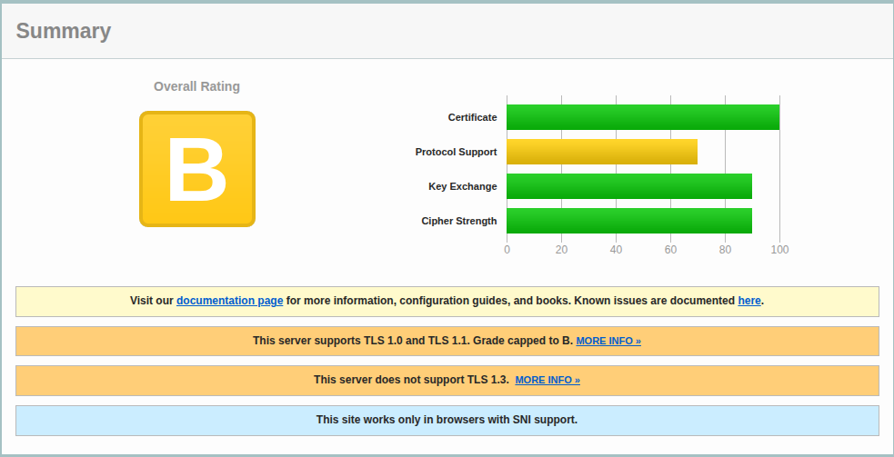

Në skemën e vlerësimit të Qualys, nota `B` përshkruhet si siguri `fair`, pra një konfigurim me disa probleme të identifikuara, por jo domosdoshmërisht kritike. Praktikisht, kjo do të thotë se `HTTPS` është i pranishëm dhe funksional, por serveri nuk është i optimizuar plotësisht sipas standardeve më të forta moderne të `TLS`.

### SecurityHeaders

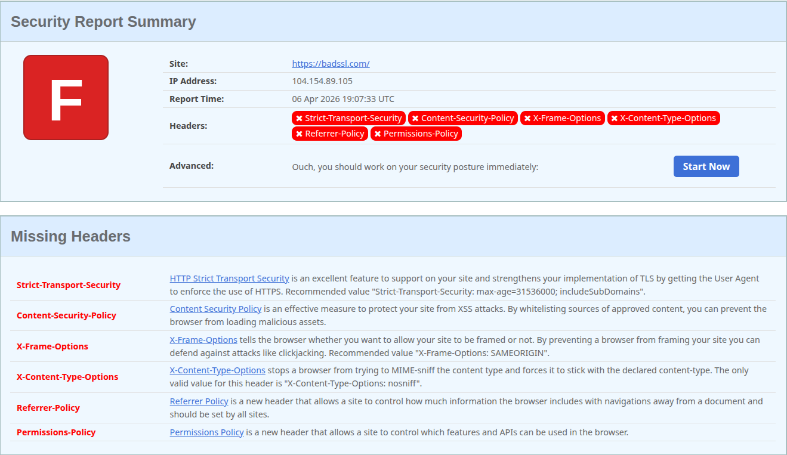

Për analizimin e header-ave të sigurisë u përdor `SecurityHeaders`, i cili vlerëson praninë dhe konfigurimin e `HTTP response headers` që lidhen me forcimin e aplikacioneve web. Gjatë testimit të `badssl.com`, target-i mori notën `F`, çka tregon një nivel shumë të ulët të mbrojtjes në aspektin e header-ave të sigurisë.

Rezultati tregoi mungesën e disa header-ave shumë të rëndësishëm, si:

- Strict-Transport-Security
- Content-Security-Policy
- X-Frame-Options
- X-Content-Type-Options
  -Referrer-Policy dhe Permissions-Policy

Këta header-a kanë rol të rëndësishëm në mbrojtjen ndaj sulmeve të zakonshme web, si ekzekutimi i përmbajtjes së paautorizuar, clickjacking, MIME sniffing dhe ekspozimi i panevojshëm i informacionit gjatë navigimit.

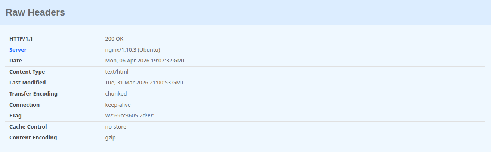

Përveç kësaj, nga raw headers u vu re edhe ekspozimi i header-it Server, i cili zbulon teknologjinë e përdorur nga ana e serverit. Kjo nuk përbën domosdoshmërisht një cënueshmëri direkte, por rrit sipërfaqen e fingerprinting dhe mund të ndihmojë një sulmues në identifikimin e stack-un teknologjik.

> [!NOTE]
> Duhet theksuar se badssl.com është një platformë demonstrimi për skenarë të ndryshëm SSL/TLS, prandaj rezultati i marrë duhet interpretuar në kontekst testimi dhe jo si vlerësim i një faqeje.

### MDN HTTP Observatory

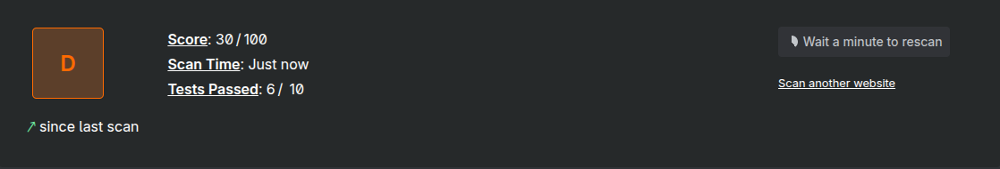

Për vlerësimin e konfigurimeve të sigurisë `HTTP` u përdor `MDN HTTP Observatory`, një mjet i zhvilluar nga Mozilla për analizimin e header-ave të sigurisë dhe të praktikave bazë të mbrojtjes së faqeve web. Gjatë testimit të `badssl.com`, target-i mori notën `D` me një rezultat prej `30/100`, ndërsa vetëm `6` teste kaluan.

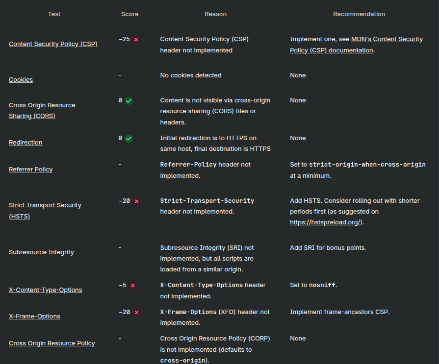

Ky rezultat tregon se faqja ka disa mekanizma bazë të sigurisë të konfiguruar siç duhet, por niveli i përgjithshëm i hardening mbetet i dobët. Problemet kryesore u identifikuan te mungesa e:

- Content-Security-Policy
- Strict-Transport-Security
- X-Content-Type-Options
- X-Frame-Options dhe Referrer-Policy

të cilët konsiderohen elemente të rëndësishme për mbrojtjen kundër sulmeve si XSS, clickjacking, MIME sniffing dhe rrjedhja e informacionit gjatë navigimit.

Nga ana tjetër, testi i redirektimit rezultoi pozitiv, duke treguar se ridrejtimi fillestar kryhet drejt `HTTPS` në të njëjtin host, ndërsa kontrolli për `CORS` gjithashtu kaloi. Kjo tregon se ndonëse faqja ka disa elemente të sakta konfigurimi, mungesa e headers kryesorë vazhdon të ulë ndjeshëm rezultatin e përgjithshëm.

> [!NOTE]
> Rezultati i MDN HTTP Observatory duhet interpretuar si tregues i nivelit të hardening-ut të konfigurimit HTTP dhe jo si provë e sigurisë së plotë të aplikacionit, sepse vetë mjeti fokusohet në header dhe best practices të transportit, jo në të gjitha kategoritë e cenueshmërive në web.

### VirusTools URL Scan

Për kontrollin e reputacionit të URL-së u përdor `VirusTotal URL Scan`, i cili analizon URL-të duke i krahasuar me shumë engine dhe burime të inteligjencës së kërcënimeve. Në këtë rast u testua URL-ja https://www.amtso.org/check-desktop-phishing-page/, e cila është një faqe testuese e publikuar nga `AMTSO` për të verifikuar funksionimin e mekanizmave anti-phishing.

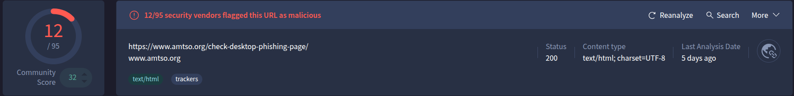

Rezultati i skanimit ishte `12/95`, që do të thotë se `12` engine e klasifikuan URL-në si problematike, kryesisht në kategorinë `Phishing`, ndërsa disa engine e klasifikuan si `Malicious`. Sipas dokumentimit të `VirusTotal`, verdiktet e tilla tregojnë mënyrën se si partnerë të ndryshëm të sigurisë e vlerësojnë një URL dhe mund të përfshijnë kategori si clean site, phishing site, malware site, malicious site ose unrated site.

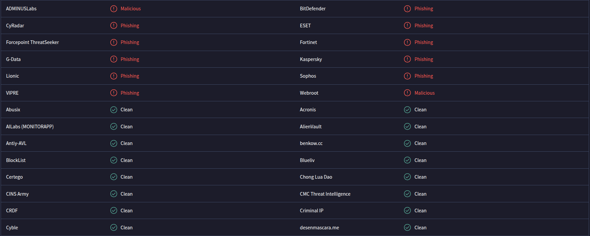

Ky rezultat është i pritshëm, sepse URL-ja e testuar nuk ishte një faqe e zakonshme publike, por një faqe demonstrimi e krijuar posaçërisht për testimin e zbulimit të phishing-ut. Për këtë arsye, detektimet e marra nuk duhet interpretuar si provë se faqja është realisht komprometuese ose keqdashëse, por si tregues se disa engine e njohin atë si URL testuese që simulon sjellje phishing.

Në të njëjtën kohë, fakti që shumë engine të tjera e shënuan URL-në si clean ose unrated tregon se VirusTotal duhet interpretuar me kujdes dhe në kontekst, pasi vetë platforma grumbullon verdikte nga burime të shumta dhe nuk gjeneron vetë vendim unik përfundimtar.

### badssl

Për demonstrimin praktik të sjelljes së browser-it ndaj konfigurimeve të ndryshme `SSL/TLS` u përdor `badssl`, një platformë publike e ndërtuar posaçërisht për testimin e certifikatave, protokolleve dhe politikave të sigurisë së transportit. Ndryshe nga mjetet që japin nota ose score, badssl u përdor si mjedis testues për të vëzhguar drejtpërdrejt reagimin e browser-it në skenarë të ndryshëm të sigurisë HTTPS.

#### `expired.badssl.com`

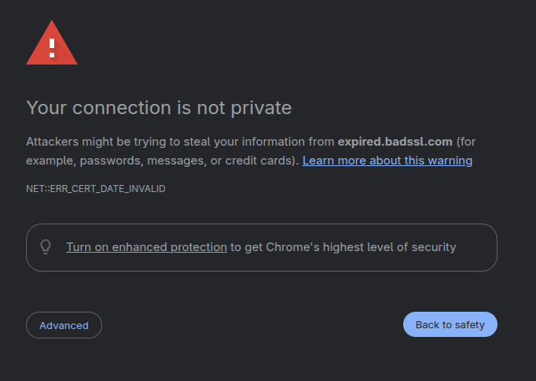

Browser-i shfaqi paralajmërimin `Your connection is not private` dhe kodin e gabimit `NET::ERR_CERT_DATE_INVALID`. Ky rezultat tregon se certifikata e serverit është e skaduar dhe nuk konsiderohet më e vlefshme nga browser-i, prandaj lidhja nuk mund të konsiderohet e besueshme.

#### `self-signed.badssl.com`

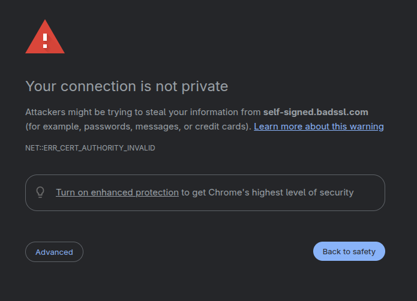

Në rastin e `self-signed.badssl.com`, browser-i shfaqi gjithashtu paralajmërimin `Your connection is not private`, por me kodin `NET::ERR_CERT_AUTHORITY_INVALID`. Ky rast demonstron se prania e `HTTPS` nuk mjafton nëse certifikata nuk është lëshuar nga një autoritet certifikues i besuar, pasi browser-i nuk mund të verifikojë zinxhirin e besimit të certifikatës.

#### `hsts.badssl.com`

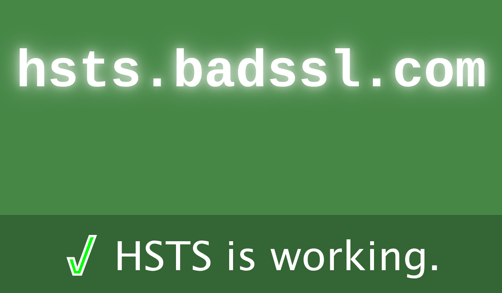

Për `hsts.badssl.com`, rezultati ishte `HSTS is working`, çka tregon se politika `HTTP Strict Transport Security` po zbatohet siç duhet. Kjo demonstron se browser-i detyrohet të përdorë `HTTPS` dhe nuk lejon rënie të lidhjes në `HTTP` të pasigurt për këtë host.

#### `tls-v1-0.badssl.com`

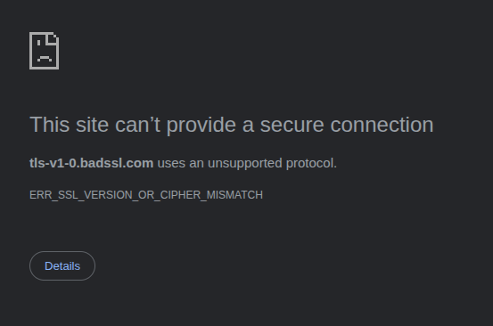

Në testimin e `tls-v1-0.badssl.com`, browser-i shfaqi mesazhin `This site can’t provide a secure connection` me gabimin `ERR_SSL_VERSION_OR_CIPHER_MISMATCH`. Ky rezultat tregon se serveri përdor një protokoll ose konfigurim `TLS` që browser-i e konsideron të papranueshëm sipas standardeve moderne të sigurisë.

## 5. Python analyzer, remediation dhe përfundime

Për të avancuar aktivitetin analizues është ndërtuar një analyzer i thjeshtë në Python, me funksion profilizimin bazë të një target-i web në lidhje me security headers, login/forms me `HTTP`, exposed files dhe paths me interes. Ky analyzer nuk synon të zëvendësojë scanners të specializuar si `ZAP`, `Burp Suite` apo `Nuclei`, por të shërbejë si një shtesë praktike.

### Instalimi dhe ekzekutimi i analyzer-it

```bash
mkdir python-analyzer
cd python-analyzer
python -m venv venv
source venv/bin/activate
pip install requests beautifulsoup4
```

```bash
python scanner.py
```

Target-et e testimit:

- http://127.0.0.1:3000
- https://localhost:8443

### Shembull i kodit `scanner.py`

```python
import requests
from bs4 import BeautifulSoup
from urllib.parse import urljoin
import json

TARGET = input("Target URL: ").strip()
results = []

COMMON_PATHS = ["/robots.txt", "/sitemap.xml", "/admin", "/backup", "/api-docs"]

SECURITY_HEADERS = [
    "Content-Security-Policy",
    "Strict-Transport-Security",
    "X-Content-Type-Options",
    "X-Frame-Options",
    "Referrer-Policy",
    "Permissions-Policy"
]

def add_finding(title, severity, evidence, remediation):
    results.append({
        "finding": title,
        "severity": severity,
        "evidence": evidence,
        "remediation": remediation
    })

try:
    r = requests.get(TARGET, timeout=10, verify=False)
    headers = r.headers

    if TARGET.startswith("http://"):
        add_finding(
            "HTTP used instead of HTTPS",
            "High",
            TARGET,
            "Serve the application over HTTPS and redirect HTTP to HTTPS."
        )

    for h in SECURITY_HEADERS:
        if h not in headers:
            add_finding(
                f"Missing security header: {h}",
                "Medium",
                f"{h} not present",
                f"Configure the server to return the {h} header."
            )

    if "Server" in headers:
        add_finding(
            "Server banner disclosed",
            "Low",
            headers["Server"],
            "Reduce or suppress server version disclosure."
        )

    soup = BeautifulSoup(r.text, "html.parser")
    forms = soup.find_all("form")
    for form in forms:
        action = form.get("action", "")
        full_action = urljoin(TARGET, action)
        if full_action.startswith("http://"):
            add_finding(
                "Form submits over HTTP",
                "High",
                full_action,
                "Ensure forms submit only over HTTPS."
            )

    for path in COMMON_PATHS:
        test_url = urljoin(TARGET, path)
        try:
            rr = requests.get(test_url, timeout=5, verify=False)
            if rr.status_code == 200:
                add_finding(
                    f"Interesting path exposed: {path}",
                    "Low",
                    test_url,
                    "Review whether this path should remain public."
                )
        except:
            pass

    risk_score = 0
    for item in results:
        if item["severity"] == "High":
            risk_score += 3
        elif item["severity"] == "Medium":
            risk_score += 2
        else:
            risk_score += 1

    report = {
        "target": TARGET,
        "risk_score": risk_score,
        "findings": results
    }

    with open("report.json", "w") as f:
        json.dump(report, f, indent=2)

    print("Done. Report saved to report.json")

except Exception as e:
    print("Scan error:", e)
```

## Përfundime

Nga analiza rezulton se përdorimi i `HTTPS` përmirëson ndjeshëm transport security, por nuk mjafton për të eliminuar dobësitë që burojnë nga vetë aplikacioni. Gjetjet e tools tregojnë se një posture më e fortë sigurie arrihet vetëm kur transporti i enkriptuar kombinohet me hardening të server-it, defensive headers, konfigurim korrekt `TLS` dhe kontroll të vazhdueshëm të application-layer vulnerabilities.
